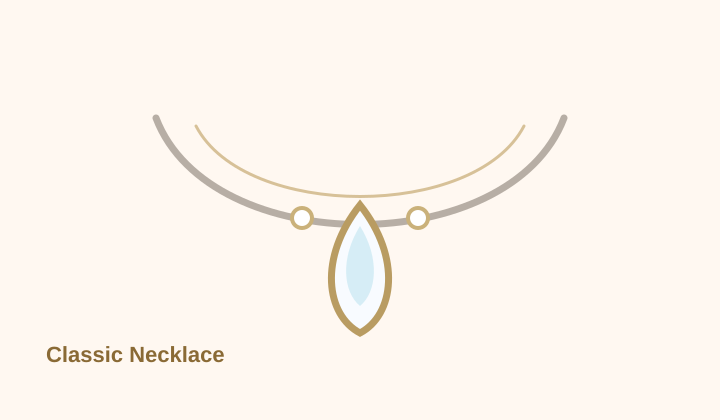
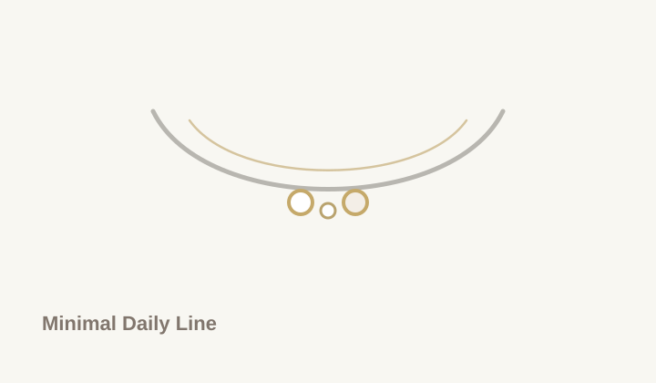
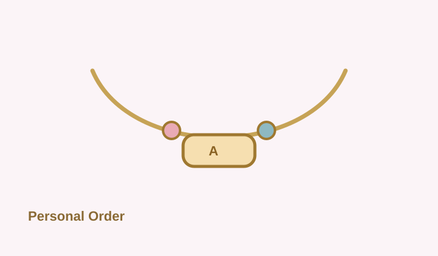
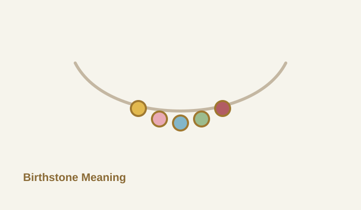
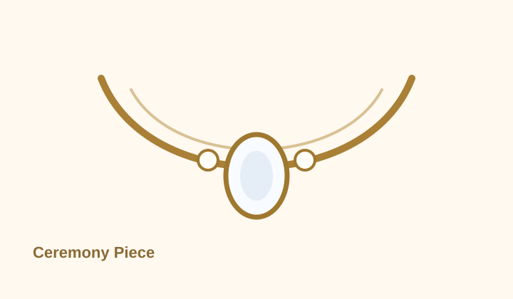

# 產品展示

Soft Jewelry Studio 目前以五個項鍊系列作為設計起點。你可以先選擇接近的風格，再進入 3D 設計工作台調整吊墜、寶石與排列方向。

<section class="collection-editorial" aria-label="系列策展">
  

    
Curated Collections

    <h2>以系列陳列，而不是用規格堆滿頁面</h2>
    
每個系列都有明確情境：日常、送禮、個人符號、誕生石或儀式場合。先看整體氣質，再進入 3D 工作台做細節調整。

  

  <a class="md-button md-button--primary" href="/-/viewer/">進入私人設計工作台</a>
</section>

<section class="selection-assist-panel" aria-label="選款導引">
  

    
Selection Assist

    <h2>不知道從哪一款開始，可以先用需求選</h2>
    
每個系列都可以再進 3D 工作台微調。先選接近用途的方向，比一開始比較所有細節更快，也更接近實際訂製流程。

  

  

    <a href="#daily-series">
      <strong>每天都想戴</strong>
      先看簡約款或經典款。
    </a>
    <a href="#meaning-series">
      <strong>想送一份有寓意的禮物</strong>
      先看誕生石款或客製款。
    </a>
    <a href="#occasion-series">
      <strong>要搭正式場合</strong>
      先看儀式款與橄欖主石比例。
    </a>
  

</section>

<section class="fit-guide-panel" aria-label="選購前確認">
  

    
Fit & Gift Guide

    <h2>選購前先確認三件事</h2>
    
參考精品與珠寶電商品牌常見流程，先把用途、配戴長度與個人化方向收斂，後續詢問會更快得到可報價的設計方向。

  

  

    <article>
      01
      <strong>用途</strong>
      
日常、生日、週年、婚禮或拍攝場合會影響主石大小與光感強度。

    </article>
    <article>
      02
      <strong>鍊長</strong>
      
38-43 cm 偏鎖骨短鍊，40-45 cm 適合多數日常，45 cm 以上會更有垂墜感。

    </article>
    <article>
      03
      <strong>個人化</strong>
      
可先準備誕生石、初始字母、刻字方向、禮物訊息與希望完成時間。

    </article>
  

</section>

<section class="atelier-readiness-panel" aria-label="訂製前準備">
  

    
Atelier Readiness

    <h2>像進精品專櫃前一樣，先整理可討論的設計資訊</h2>
    
參考精品珠寶常見的尺寸教育、刻字服務、保養提醒與顧問式詢問流程，將訂製前資訊整理成四個可行動步驟。這些資訊不需要後端，也能讓訪客更快進入 3D 設計與詢問。

  

  

    <article>
      01
      <strong>確認配戴高度</strong>
      
先決定鎖骨短鍊、日常鍊長或垂墜比例，再用 3D / AR 檢查主石落點。

    </article>
    <article>
      02
      <strong>準備個人化訊息</strong>
      
姓名縮寫、日期、誕生石、關係寓意與禮物訊息，都可以先整理成一段訂製方向。

    </article>
    <article>
      03
      <strong>選擇材質與照護習慣</strong>
      
日常高頻配戴優先穩定材質與低調結構；珍珠、鍍色與寶石則需要更明確的保養提醒。

    </article>
    <article>
      04
      <strong>帶著摘要詢問</strong>
      
送出詢問前，先準備預算、希望完成時間、鍊長、金屬色與 AR 試戴截圖。

    </article>
  

  

    <a class="md-button md-button--primary" href="/-/viewer/">整理我的 3D 設計</a>
    <a class="md-button" href="/-/#contact">查看詢問方式</a>
  

</section>

<!-- Product image alt rule: replace each placeholder with a real image only when the alt text describes the necklace series, visible materials, color, pendant shape, and intended styling instead of generic words like "product photo". -->

<article id="daily-series" class="product-series-card">
  <figure class="product-image-frame">
    
  </figure>
  

    
Signature Series

    <h2>經典款</h2>
    
適合日常配戴與紀念送禮的柔和主石項鍊。

    <dl class="product-spec-list">
      

        <dt>材質</dt>
        <dd>銀色鍊條、主石吊墜，可討論金色或玫瑰金色系。</dd>
      

      

        <dt>尺寸</dt>
        <dd>建議鍊長 40-45 cm，吊墜約 8-14 mm，依配戴比例調整。</dd>
      

      

        <dt>可客製項目</dt>
        <dd>主石形狀、寶石色系、鍊長、吊墜比例、紀念寓意。</dd>
      

      

        <dt>價格 / 詢價</dt>
        <dd>依材質、寶石與製作細節報價，適合先提供預算範圍討論。</dd>
      

    </dl>
    

      <a class="md-button md-button--primary" href="/-/viewer/">前往 3D 設計</a>
      <a class="md-button" href="/-/#contact">詢問訂製</a>
    

  

</article>

<article class="product-series-card">
  <figure class="product-image-frame">
    
  </figure>
  

    
Daily Line

    <h2>簡約款</h2>
    
低調、乾淨、容易搭配襯衫與針織的日常項鍊。

    <dl class="product-spec-list">
      

        <dt>材質</dt>
        <dd>細鍊、單顆小鑽或珍珠元素，可選銀色或暖金色調。</dd>
      

      

        <dt>尺寸</dt>
        <dd>建議鍊長 38-43 cm，點綴元素約 4-8 mm。</dd>
      

      

        <dt>可客製項目</dt>
        <dd>鍊條款式、單點寶石、珍珠大小、配戴長度、金屬色。</dd>
      

      

        <dt>價格 / 詢價</dt>
        <dd>以基礎材質與點綴件報價，適合想先確認日常款預算的需求。</dd>
      

    </dl>
    

      <a class="md-button md-button--primary" href="/-/viewer/">前往 3D 設計</a>
      <a class="md-button" href="/-/#contact">詢問訂製</a>
    

  

</article>

<article id="meaning-series" class="product-series-card">
  <figure class="product-image-frame">
    
  </figure>
  

    
Personal Order

    <h2>客製款</h2>
    
為生日、紀念日、關係寓意或專屬符號設計的訂製項鍊。

    <dl class="product-spec-list">
      

        <dt>材質</dt>
        <dd>依需求討論金屬色、寶石組合、珍珠、吊墜符號與表面質感。</dd>
      

      

        <dt>尺寸</dt>
        <dd>依配戴者頸圍、穿搭習慣與吊墜比例客製，建議先用 AR 試戴確認。</dd>
      

      

        <dt>可客製項目</dt>
        <dd>寶石排列、專屬寓意、吊墜輪廓、鍊長、禮盒與訊息卡方向。</dd>
      

      

        <dt>價格 / 詢價</dt>
        <dd>客製款需先確認需求與交付時間，再依複雜度提供估價。</dd>
      

    </dl>
    

      <a class="md-button md-button--primary" href="/-/viewer/">前往 3D 設計</a>
      <a class="md-button" href="/-/#contact">詢問訂製</a>
    

  

</article>

<article class="product-series-card product-series-card--highlight">
  <figure class="product-image-frame">
    
  </figure>
  

    
Meaning Line

    <h2>誕生石款</h2>
    
以月份、關係或紀念日為核心，讓寶石成為可配戴的個人標記。

    <dl class="product-spec-list">
      

        <dt>材質</dt>
        <dd>銀色、金色或玫瑰金細鍊，搭配小尺寸彩色寶石與簡約吊墜。</dd>
      

      

        <dt>尺寸</dt>
        <dd>建議鍊長 40-45 cm，寶石約 3-6 mm，可做單顆或多顆排列。</dd>
      

      

        <dt>可客製項目</dt>
        <dd>月份寶石、雙人紀念石、排列順序、吊墜刻字方向、禮盒訊息。</dd>
      

      

        <dt>價格 / 詢價</dt>
        <dd>依寶石種類與顆數報價，適合生日、紀念日與關係禮物。</dd>
      

    </dl>
    

      <a class="md-button md-button--primary" href="/-/viewer/">前往 3D 設計</a>
      <a class="md-button" href="/-/#contact">詢問訂製</a>
    

  

</article>

<article id="occasion-series" class="product-series-card">
  <figure class="product-image-frame">
    
  </figure>
  

    
Occasion Piece

    <h2>儀式款</h2>
    
為婚禮、週年、重要拍攝與正式場合設計的存在感項鍊。

    <dl class="product-spec-list">
      

        <dt>材質</dt>
        <dd>主石、珍珠、小鑽與較明顯的鍊型，可依禮服或西裝領口調整。</dd>
      

      

        <dt>尺寸</dt>
        <dd>建議鍊長 38-45 cm，主視覺元素約 10-18 mm。</dd>
      

      

        <dt>可客製項目</dt>
        <dd>主石比例、垂墜位置、對稱或非對稱排列、金屬色與配戴場合。</dd>
      

      

        <dt>價格 / 詢價</dt>
        <dd>依儀式需求、材質與完成時間估價，建議提前討論。</dd>
      

    </dl>
    

      <a class="md-button md-button--primary" href="/-/viewer/">前往 3D 設計</a>
      <a class="md-button" href="/-/#contact">詢問訂製</a>
    

  

</article>

## 配戴投影與設計方向

<section class="styling-projection-card">
  
Daily Projection

  <h3>日常鎖骨比例</h3>
  
以 38-43 cm 細鍊、珍珠或小鑽為主，讓視覺重心貼近鎖骨，適合襯衫、針織與日常穿搭。

  <a href="/-/viewer/">套用 3D 設計方向</a>
</section>

<section class="styling-projection-card">
  
Gift Meaning

  <h3>誕生石與關係寓意</h3>
  
用月份寶石、初始字母或刻字牌建立可溝通的故事，讓禮物不只停留在外觀。

  <a href="/-/viewer/">建立寓意組合</a>
</section>

<section class="styling-projection-card">
  
Occasion Styling

  <h3>儀式與拍攝存在感</h3>
  
放大主石、垂墜位置與鍊型線條，先用 3D 與 AR 確認在禮服、襯衫或正式穿搭上的比例。

  <a href="/-/viewer/">預覽儀式款</a>
</section>

## 詢問前可以先準備

- 預計用途：日常配戴、送禮、紀念日、婚禮或其他場合。
- 喜歡的色系：銀色、金色、玫瑰金、珍珠白、藍色、粉色或綠色寶石。
- 配戴長度：貼近鎖骨、一般鎖骨鍊，或希望更長的垂墜感。
- 預算範圍與希望完成時間。

